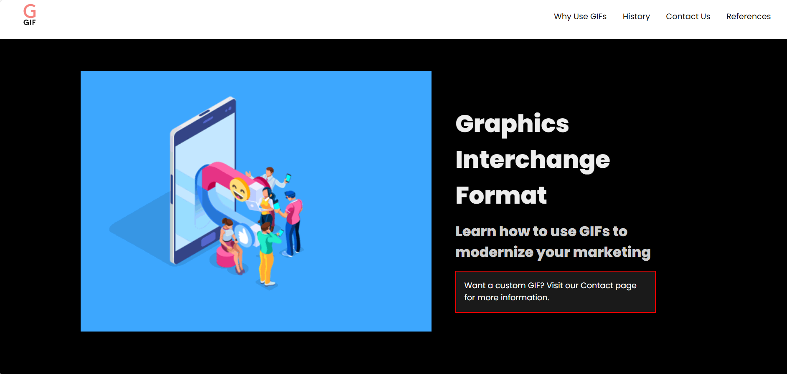
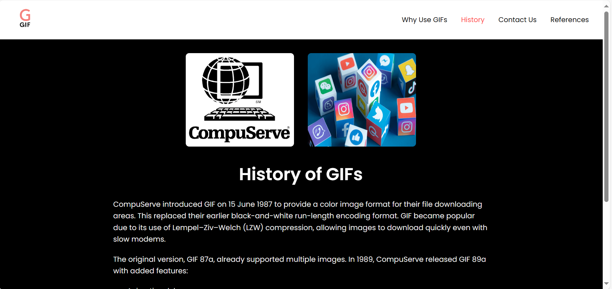
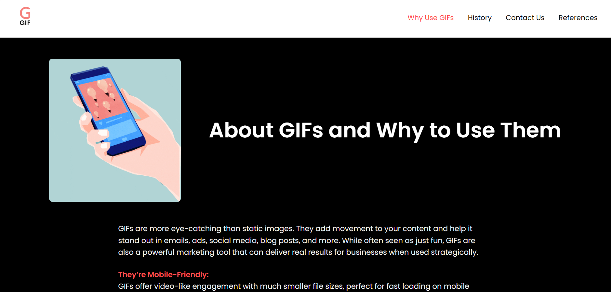
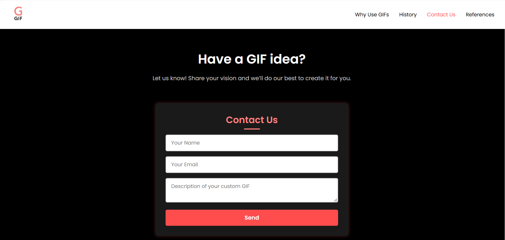
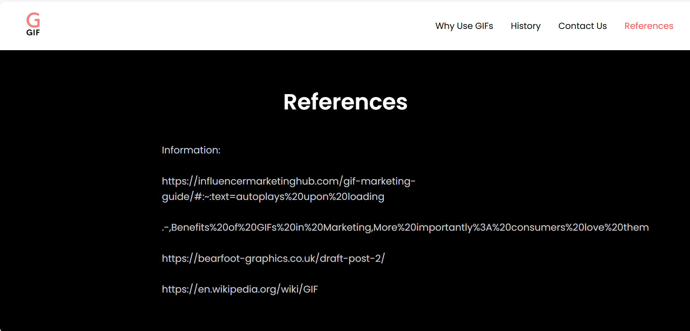

# GIF-Informative-Website

<h2>Description</h2>
This project is a website that aims to educate users about GIFs. It includes sections about what GIFs are, their history, and why they are widely used today. The content is presented in a clean, user-friendly format with simple navigation and accessible design.
 

<h2>Technologies Used</h2>
- <b>HTML</b> 
- <b>CSS</b> 
 

<h2>Environment Used</h2>
- <b>Visual Studio Code</b> 
- <b>Figma</b> 
 

<h2>Pages Included</h2>
- <b>Home Page:</b> Introduction to the topic 
- <b>History of GIFs:</b> Timeline and origin of the format 
- <b>Modern Uses:</b> Social media, communication, and marketing 
- <b>Contact Page:</b> Basic form for feedback or questions 
- <b>References Page:</b> Sources cited for the site content
 

<h2>Design Process</h2>
The website was created through a structured design process that included:
<ul>
  <li>Identifying the target audience and purpose of the site</li>
  <li>Creating wireframes and mockups to plan layout and content flow</li>
  <li>Building the site using semantic HTML and responsive CSS</li>
  <li>Testing usability and responsiveness on multiple devices</li>
</ul>

<h2>Contribution</h2>
This was an individual project. All research, design, and development were completed independently.
 

<h2>Screenshots</h2>

<b>Home Page</b> 

  

<b>History of GIFs Page</b> 

  

<b>Modern Uses Page</b> 

  

<b>Contact Page</b> 

  

<b>References Page</b> 

  

